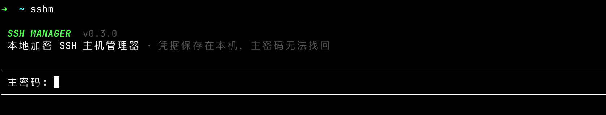
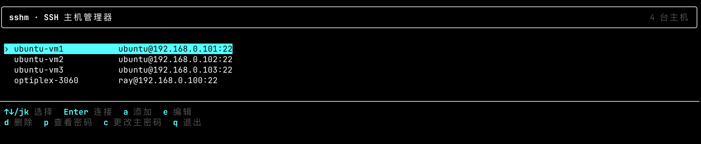

# node-ssh-manager

[](https://www.npmjs.com/package/node-ssh-manager)

在终端里管理 SSH 主机。安装后运行 `sshm`，凭据加密存放在本机，主密码无法找回。

## 截图





## 安装

需要 [Node.js](https://nodejs.org/) 18+。

```bash
npm install -g node-ssh-manager
sshm
```

也可以不安装，直接：

```bash
npx --package node-ssh-manager sshm
```

首次运行会设置主密码并创建空 vault；之后每次启动用同一主密码解锁。

## 快捷键

主机列表：

| 按键 | 作用 |
| --- | --- |
| `↑` `↓` 或 `k` `j` | 选择主机 |
| `Enter` | 连接 |
| `a` | 添加 |
| `e` | 编辑 |
| `d` | 删除 |
| `p` | 查看密码 |
| `c` | 更改主密码 |
| `q` | 退出 |

添加或编辑主机：`Tab` / `Shift+Tab` 切换字段，`Ctrl+S` 保存，`Ctrl+R` 显示或隐藏密码，`Esc` 取消。

更改主密码：先输入当前主密码，再输入并确认新密码；`Esc` 取消。

## 数据与加密

- `~/.sshm/vault.enc` — 加密的主机数据
- `~/.sshm/known_hosts.json` — 已信任的主机指纹

Vault 使用 AES-256-GCM，密钥由主密码经 scrypt 派生。**忘记主密码等于永久丢失全部主机凭据**，没有恢复途径。

## 限制

- 只支持密码认证，不支持 SSH key、agent、ProxyJump
- 单用户、单机使用，没有同步或共享
- 不导入、不导出，也不解析 `~/.ssh/config`

## 从源码运行

```bash
pnpm install
pnpm dev
```

发布构建：

```bash
pnpm build
node bin/sshm.js
```

## License

MIT
